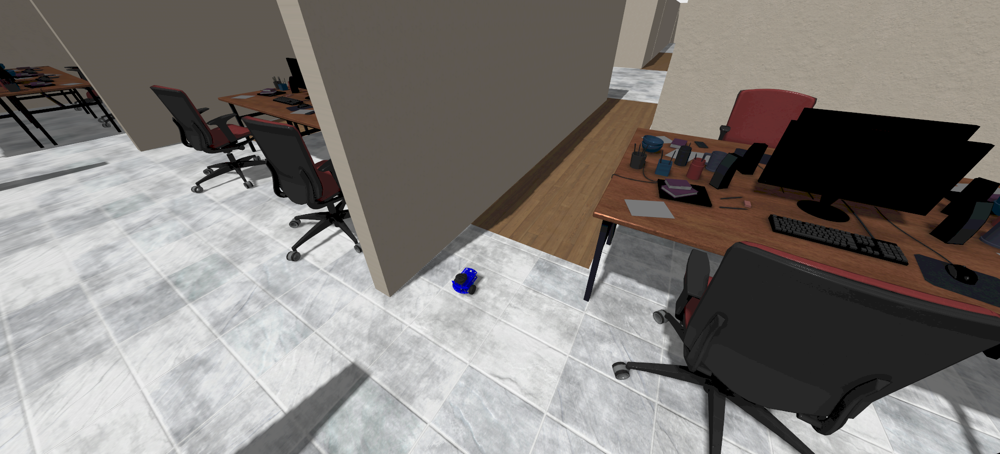

# Andino Gazebo Simulation




## :clipboard: Description

This package provides a simulation environment for [Andino](https://github.com/Ekumen-OS/andino) in [Gazebo Harmonic](https://gazebosim.org/home) relying on [ros_gz](https://github.com/gazebosim/ros_gz) to integrate it with ROS 2.

## :clamp: Platforms

- ROS 2: Jazzy Hawksbill
- OS:
  - Ubuntu 24.04 Noble Numbat
- Gazebo:
  - Harmonic

## :inbox_tray: Installation

1. Clone this repository

```sh
git clone git@github.com:ekumenlabs/andino_gz.git
```

2. Set up docker environment:
Refer to [docker readme](docker/README.md)

Once the container is running and dependencies have been installed you can proceed to package building.

## :package: Build

The package contains some dependencies that must be installed in order to build it:

```
rosdep install --from-paths src -i -y
```

Then build the package and source the install workspace. To do so run the following commands:

```sh
colcon build
source install/setup.bash
```

## :rocket: Usage

### Andino simulation


Once the package is built and sourced, you can start a simulation.

  ```sh
  ros2 launch andino_gz andino_gz.launch.py
  ```

_Note: You can use `world_name` flag to indicate other [world](andino_gz/worlds/) to use. (For example: `depot.sdf`(default), `office.sdf`, `populated_office.sdf`, `empty.sdf`)_

By default the ros bridge and rviz are initialized. In case you prefer to disable any of those you can do it via its flags:

  ```sh
  ros2 launch andino_gz andino_gz.launch.py ros_bridge:=False rviz:=False
  ```

To see a complete list of available arguments for the launch file do:
  ```sh
  ros2 launch andino_gz andino_gz.launch.py --show-args
  ```

Using a different world:
  ```sh
  ros2 launch andino_gz andino_gz.launch.py world_name:=populated_office.sdf
  ```


Make sure to review the required topics using `gz topic --list` and `ros2 topic` CLI tools.
Also, consider using looking at the translation entries under `andino_gz/config/bridge_config.yaml`.

### :robot::robot::robot: Multi robot simulation

  This simulation also supports multi-robot simulation.

  ```sh
  ros2 launch andino_gz andino_gz.launch.py robots:="
       andino1={x: 0.0, y: 0.0, z: 0.1, yaw: 0.};
       andino2={x: -0.4, y: 0.1, z: 0.1, yaw: 0.};
       andino3={x: -0.4, y: -0.1, z: 0.1, yaw: 0.};
       andino4={x: -0.8, y: 0.2, z: 0.1, yaw: 0.};
       andino5={x: -0.8, y: -0.2, z: 0.1, yaw: 0.};
       andino6={x: -0.8, y: 0.0, z: 0.1, yaw: 0.};"
  ```

  - _Note1: You can add as many Andino as you want._
  - _Note2: If enabling Nav2(Using `nav2:=True`) try first with 2 robots and see how they perform in your system before using more robots._

  

  The launch file is in charge of:
   - Start Gazebo simulator with a defined world (See '--world_name' flag)
   - Spawn as many robots as commanded.
   - Launch ros bridge for each robot.
   - Launch Rviz visualization for each robot.

  The simulation allows you to spawn as many robots as you want via the `--robots` flags.
  For that, you can pass the information of the robots in some YAML format via ROS2 cli:
  ```yaml
    <robot_name>={x: 0.0, y: 0.0, yaw: 0.0, roll: 0.0, pitch: 0.0, yaw: 0.0};
  ```

  - _Note1: A ROS Namespace is pushed for each robot so all the topics and nodes are called the same with a difference of a `<robot_name>` prefix._
  - _Note2: For RViz2 to work with the ROS namespace that is pushed, one has to ensure that no absolute topics are being used._

### :compass: Navigation


1. Run the simulation passing the `nav2` flag.

    ```sh
    ros2 launch andino_gz andino_gz.launch.py nav2:=True
    ```

    As before, you can launch as many robots as you want, for example launching two:

    ```sh
    ros2 launch andino_gz andino_gz.launch.py nav2:=True robots:="andino1={x: 0.0, y: 0.0, z: 0.1, yaw: 0.};andino2={x: 1.0, y: 0.0, z: 0.1, yaw: 0.};"
    ```

    Once Gazebo window pops up, play the simulation using the gui.

    **Important!**:
      -  When using `nav2` flag, the `map` must match the selected `world`. For example:
         -  For `depot.sdf` world, the map need to be `depot`:
            ```
            ros2 launch andino_gz andino_gz.launch.py nav2:=True world_name:=depot.sdf map:=depot
            ```
            Typically, as this is the default world-map, there is no need to indicate them.
         -  For `office.sdf` and `populated_office.sdf` worlds, the map need to be `office`:
            ```
            ros2 launch andino_gz andino_gz.launch.py nav2:=True world_name:=office.sdf map:=office
            ```


2. An RViz window will be spawned for each robot so it can be controlled independently. Use `2D Pose Estimate` to pass a hint to AMCL where is the initial point

    Note you have to do it per robot, namely, per RViz window.


    

3. Send the desired goal using Nav2 Goal

    


### :world_map: SLAM


1. Run simulation with ros bridge and RViz.

    ```sh
    ros2 launch andino_gz andino_gz.launch.py
    ```

2. Run slam toolbox
    ```
    ros2 launch andino_gz slam_toolbox_online_async.launch.py
    ```

    Configuration can be forwarded to the `slam_toolbox_node`. By default, the configuration parameters are obtained from [andino's configuration file](https://github.com/Ekumen-OS/andino/blob/jazzy/andino_slam/config/slam_toolbox_online_async.yaml). In case a custom file is wanted to be passed, simply use the launch file argument for indicating the path to a new file.

    ```
    ros2 launch andino_gz slam_toolbox_online_async.launch.py slams_param_file:=<my_path>
    ```

3. Visualize in RViz: Add `map` panel to RViz and see how the map is being generated.

## :raised_hands: Contributing

Issues or PRs are always welcome! Please refer to [CONTRIBUTING](CONTRIBUTING.md) doc.

## Code development

Note that a [`Docker`](./docker) folder is provided for easy setting up the workspace.
